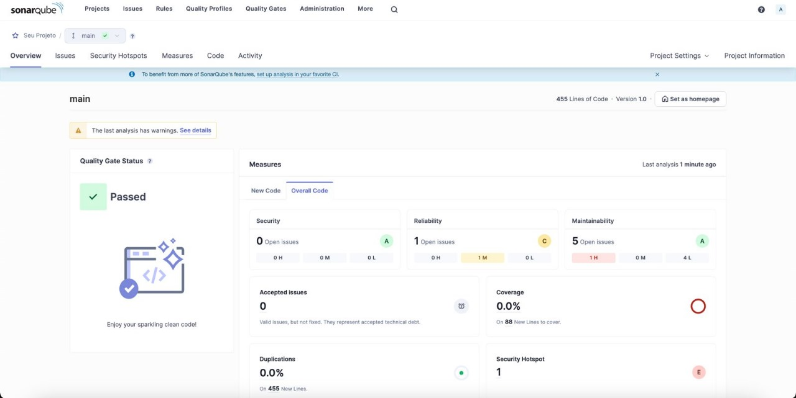

# Relatório de análise estática com SonarQube

## Como instalar e configurar o SonarQube

### Instalação do SonarQube

Para instalar o SonarQube usando Docker, é necessário executar o seguinte comando no terminal:

**docker run -d --name sonarqube -p 9000:9000 sonarqube**

Esse comando vai baixar a imagem do SonarQube (se ainda não estiver baixada) e iniciar um container chamado "sonarqube", mapeando a porta 9000 do container para a porta 9000 da sua máquina. Depois de alguns minutos, o SonarQube estará disponível.

### Acesso ao SonarQube

Você pode acessá-lo indo para http://localhost:9000 no seu navegador. As credenciais padrão para o primeiro login são:

Usuário: admin
Senha: admin
Após o primeiro login, será solicitado que você altere a senha.

### Configuração das regras costumizadas

Para configurar regras customizadas no SonarQube, siga estas etapas:

- Acesse o SonarQube através do navegador.
- No menu superior, selecione "Quality Profiles".
- Escolha o perfil de qualidade que deseja modificar ou clique em "Create" para criar um novo perfil. Você também pode clicar em "Rules" para modificar um perfil existente.
- Clique em "Activate More" para adicionar novas regras. Você pode buscar regras específicas ou filtrar por tags, tipos de severidade, entre outros.
- Selecione as regras que deseja adicionar ao perfil e clique em "Bulk Change" > "Activate".

### Vincular o repositório ao SonarQube

Para vincular seu repositório ao SonarQube e realizar análises automáticas, é necessário fazer o seguinte passo:

- No SonarQube, vá até "Administration" > "Projects" > "Management" e clique em "Create project".
- Siga as instruções para configurar a integração com seu sistema de controle de versão (GitHub, GitLab, Bitbucket), fornecendo as informações necessárias como chave do projeto e token de autenticação.
- Use as configurações fornecidas pelo SonarQube para configurar um arquivo de CI (como .gitlab-ci.yml ou .github/workflows) em seu repositório, automatizando a análise de código a cada push ou pull request.

### Execução de análise

Para visualizar os relatórios de análise no SonarQube:

- Após a conclusão da análise (manualmente via SonarScanner ou através de CI/CD), acesse o dashboard do seu projeto no SonarQube.
- Você verá um resumo da análise, incluindo métricas de qualidade do código, vulnerabilidades de segurança, dívida técnica e muito mais.
- Explore as seções "Issues", "Security Hotspots" e "Code Smells" para obter detalhes específicos e sugestões de melhoria.

É importante revisar e ajustar as configurações do projeto e do perfil de qualidade conforme necessário para atender às necessidades específicas de cada projeto.

## Análise Backend 

### Resumo

- **Status do Portão de Qualidade**: Aprovado
- **Linhas de Código**: 455
- **Problemas**:
  - **Total**: 6 Problemas
  - **Crítico**: 1 Problema
  - **Major**: 1 Problema
  - **Minor**: 4 Problemas
- **Débito Técnico**: 15min
- **Cobertura**: 0.0%
- **Ponto Sensível de Segurança**: 1

### Detalhes dos problemas

#### Severidade crítica

- **Regra**: typescript:S4123
- **Arquivo**: `src/research/research.service.ts`
- **Linha**: 136
- **Mensagem**: Refatore este 'await' redundante em uma não-promise.
- **Esforço para Corrigir**: 1min
- **Autor**: pedro.bapstista@sou.inteli.edu.br
- **Tags**: dependente de tipo, confuso
- **Data de Criação**: 2024-02-29
- **Data de Atualização**: 2024-03-06

#### Severidade Maior

- **Regra**: typescript:S2137
- **Arquivo**: `src/research/research.service.ts`
- **Linha**: 24
- **Mensagem**: Não use "JSON" para declarar uma variável - use outro nome.
- **Esforço para Corrigir**: 10min
- **Autor**: pedro.bapstista@sou.inteli.edu.br
- **Tags**: armadilha
- **Data de Criação**: 2024-02-27
- **Data de Atualização**: 2024-03-06

#### Severidade Menor

##### Importações não utilizadas

Foram identificadas importações não utilizadas que devem ser removidas para melhorar a limpeza e a manutenção do código.

1. **Arquivo**: `src/research/research.controller.ts`
   - **Linha**: 1, **Mensagem**: Remova esta importação não utilizada de 'ApiOperation'.
   - **Linha**: 3, **Mensagem**: Remova esta importação não utilizada de 'FileInterceptor'.

2. **Arquivo**: `src/research/research.service.ts`
   - **Linha**: 6, **Mensagem**: Remova esta importação não utilizada de 'DistributeDto'.
   - **Linha**: 7, **Mensagem**: Remova esta importação não utilizada de 'sendgrid'.

Cada um desses problemas requer um esforço estimado de 1min para correção.

### Recomendações

- Remova todas as importações não utilizadas para limpar o código.
- Revise o uso de 'await' para garantir a operação assíncrona adequada.
- Renomeie a variável "JSON" para evitar confusão com o objeto global JSON em JavaScript.
- Implemente testes para melhorar a cobertura de código.
- Investigue e resolva o ponto sensível de segurança identificado.

### Print executando o SonarQube

### Conclusão

O código passou pelo Portão de Qualidade do SonarQube, o que sugere que ele atende aos critérios mínimos de qualidade definidos para o projeto. No entanto, há espaço para melhorias, especialmente em termos de manutenibilidade do código e cobertura de testes.

## Análise Frontend

### Resumo
A análise estática realizada pelo SonarQube identificou um total de 28 problemas no código do Frontend. Estes problemas abrangem uma variedade de áreas, incluindo práticas de codificação, acessibilidade e eficiência.

- **Total de problemas:** 28
- **Tempo aproximado para corrigir todos os problemas:** 88 minutos
- **Componentes analisados:** 14
- **Data da análise:** 15 de Março de 2024

### Problemas detalhados

#### Severidade Maior

- **Código comentado (`typescript:S125`):** encontrado em 4 arquivos diferentes (`research.cy.ts`, `distribute.cy.ts`). Código comentado contribui para a desordem do código e dificuldade de manutenção. É aconselhável remover ou, se necessário, documentar o motivo de sua presença.
  
- **Práticas de React (`typescript:S6748`):** identificado em vários componentes (`distribution-modal.tsx`, `research-modal.tsx`). Filhos não devem ser passados como props, mas aninhados entre as tags de abertura e fechamento dos componentes.

- **Fragmento redundante (`typescript:S6749`):** observado em `distribution-list.tsx`, `research-list.tsx` e `user-list.tsx`. Um fragmento com apenas um filho é desnecessário e pode ser removido para um código mais limpo.

- **Variáveis não utilizadas (`typescript:S1854`):** detectado em `research-modal.tsx` e `distribution-modal.tsx`. Atribuições a variáveis que nunca são usadas representam código morto e devem ser removidas para melhorar a legibilidade e eficiência.

- **Acessibilidade de elementos interativos não nativos (`typescript:S6848`):** Problemas encontrados em `path.tsx`. Elementos interativos devem ser HTML nativo ou devidamente equipados com roles e manipuladores de eventos para suportar acessibilidade.

- **Desempenho e chaves React (`typescript:S6479`):** localizado em `path.tsx`. Usar índices de array como chaves em listas pode levar a problemas de desempenho e bugs durante re-renderizações. Use identificadores únicos em vez disso.

#### Severidade Menor

- **Importações não utilizadas (`typescript:S1128`):** presente em vários componentes (`header.tsx`, `path.tsx`). Importações não utilizadas devem ser removidas para limpar o código e potencialmente melhorar os tempos de compilação.

- **Problemas de acessibilidade (`typescript:S1082`, `typescript:S1077`):** encontrados em `path.tsx` e `header.tsx`. Elementos visíveis não interativos com manipuladores de cliques devem ter ouvintes de teclado. Elementos `img` devem ter props `alt` para acessibilidade.

- **Duplicação de CSS (`css:S4656`):** detectada em `research-modal.module.scss` e `distribution-modal.module.scss`. Propriedades `display` duplicadas devem ser consolidadas para prevenir confusão e garantir clareza no CSS.

### Recomendações

1. **Limpar o código:** remova código comentado, fragmentos desnecessários e variáveis não usadas para melhorar a legibilidade e manutenção do código.
2. **Seguir as melhores práticas em React:** garanta que os filhos sejam aninhados corretamente e evite passá-los como props. Refatore para usar chaves únicas para listas em vez de índices de array.
3. **Melhorar a acessibilidade:** adicione roles, suporte a teclado, mouse e entrada por toque a elementos interativos não nativos. Garanta que elementos `img` tenham atributos `alt` significativos ou uma string vazia se forem decorativos.
4. **Otimizar importações:** revise e remova importações não utilizadas regularmente para manter a base de código limpa e potencialmente acelerar a compilação.
5. **Consolidar CSS:** aborde quaisquer propriedades CSS duplicadas para garantir que o estilo seja claro e conciso, prevenindo efeitos colaterais indesejados.

### Print executando o SonarQube

### Conclusão
O código passou pelo Portão de Qualidade do SonarQube, o que sugere que ele atende aos critérios mínimos de qualidade definidos para o projeto. No entanto, há espaço para melhorias, especialmente em termos de manutenibilidade do código e boas práticas de clean code.
